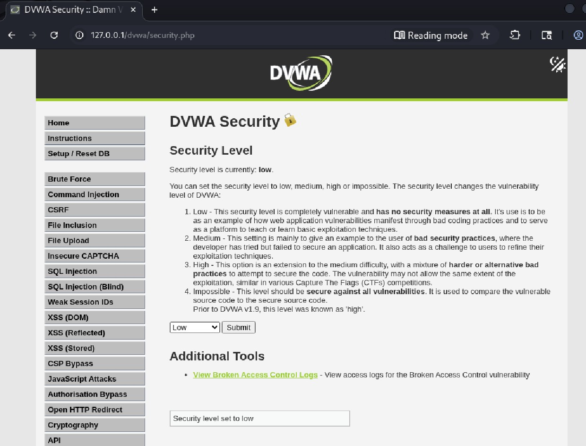
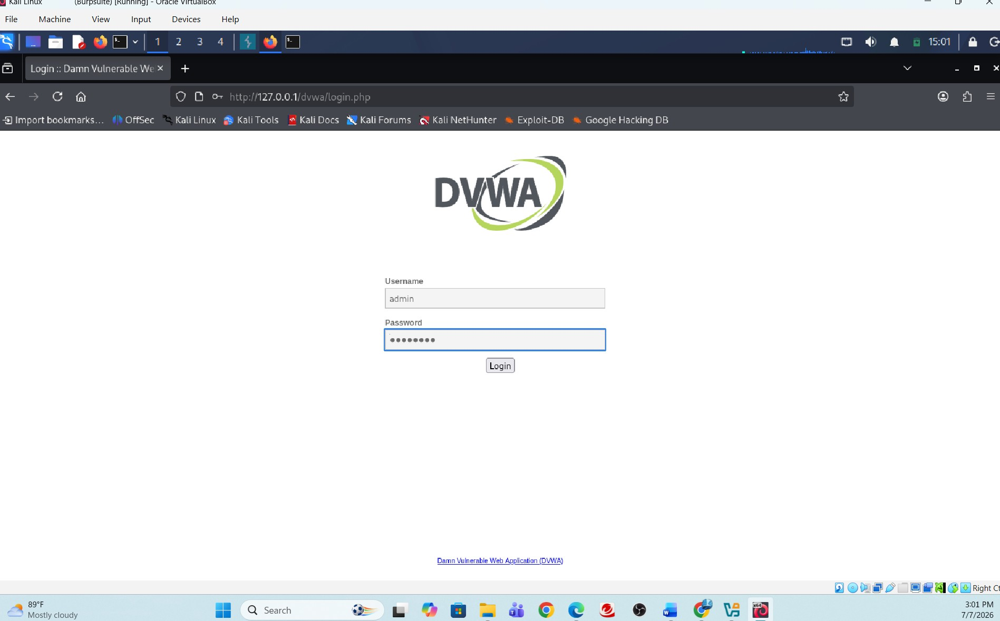
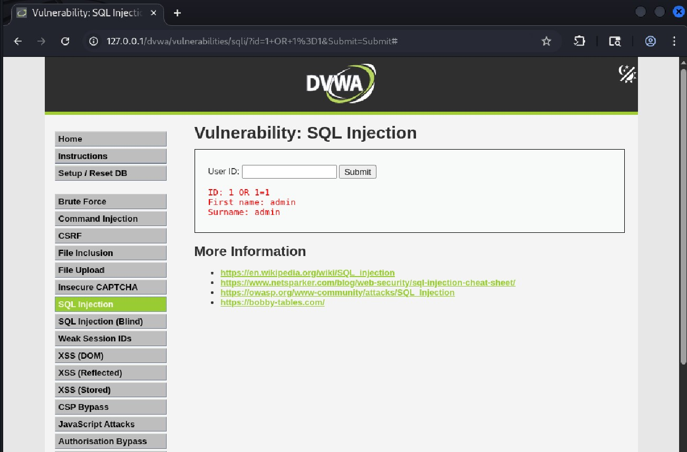
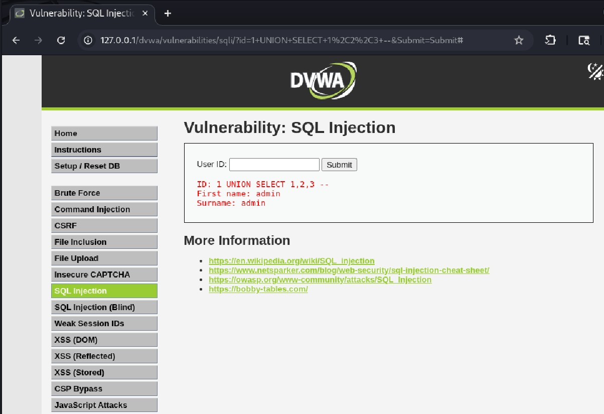
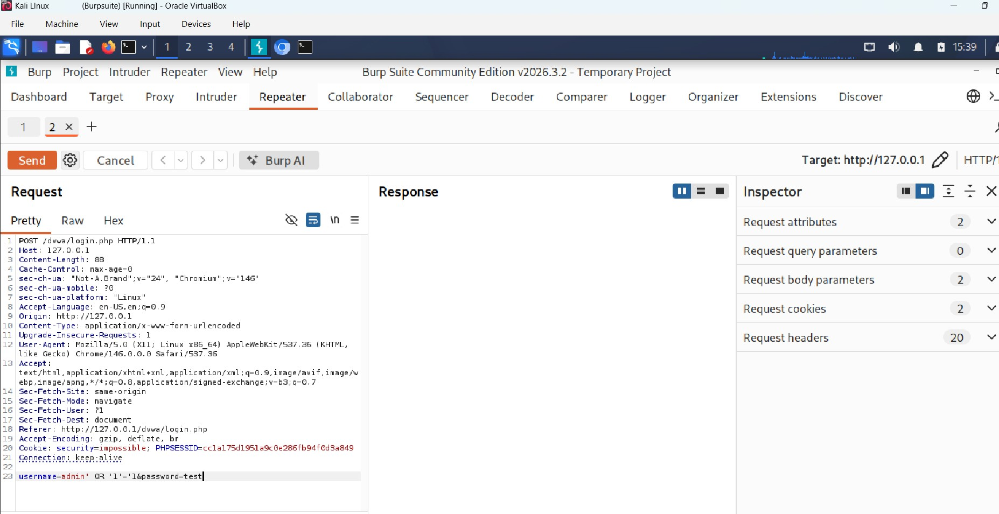
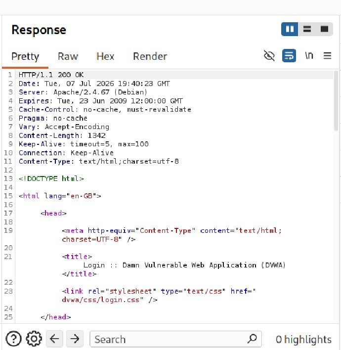

# Burp Suite Lab 1 — DVWA Interception & SQL Injection

## Overview
This lab demonstrates how to use **Burp Suite Community Edition** with **DVWA (Damn Vulnerable Web Application)** to intercept, modify, and exploit HTTP requests. Each screenshot includes a clear explanation of what is happening and why the step matters.

# 1. DVWA Configuration

## 1.1 Change DVWA Security Level to Low

DVWA’s security level is set to “Low” to intentionally disable security controls. This allows you to practice exploiting vulnerabilities such as SQL injection and command injection.

## 1.2 DVWA Login Page

This screenshot shows the DVWA login page. Logging in generates a POST request that Burp Suite can intercept and analyze, providing insight into authentication parameters.

# 2. SQL Injection Testing

## 2.1 SQL Injection (Boolean-Based)

Here you performed a basic SQL injection attack by manipulating user input. The screenshot demonstrates how DVWA responds when vulnerable to SQL injection.

## 2.2 SQL Injection (UNION-Based)

This screenshot shows a UNION-based SQL injection attack. UNION queries allow attackers to extract additional data from the database, such as usernames or table contents.

# 3. Burp Suite Repeater Exploitation

## 3.1 Modified Repeater Request

The request was sent to Burp Suite Repeater for manual manipulation. Repeater allows repeated testing of payloads without resending traffic through the browser.

## 3.2 Server Response to Modified Request

This screenshot shows the server’s response to your modified SQL injection payload. The response confirms whether the attack succeeded and what data was exposed.

# Conclusion
In this lab, you successfully:
- Set DVWA to a vulnerable security level  
- Captured DVWA login traffic using Burp Suite  
- Sent requests to Repeater  
- Performed SQL Injection attacks  
- Observed server responses  
- Verified exploitation results  

This lab demonstrates how Burp Suite can be used to analyze and manipulate web application traffic and identify critical vulnerabilities.
