# Burp Suite Web Testing

## Overview
This section demonstrates the core workflow of using **Burp Suite Community Edition** to intercept, analyze, and manipulate HTTP/S traffic. These steps represent the foundational skills required before performing targeted web application penetration tests.

The screenshots in this folder show:
- Launching Burp Suite
- Configuring browser proxy settings
- Enabling and disabling intercept
- Viewing captured traffic
- Interpreting, manipulating, and analyzing HTTP requests and responses

---

## 1. Start Burp Suite
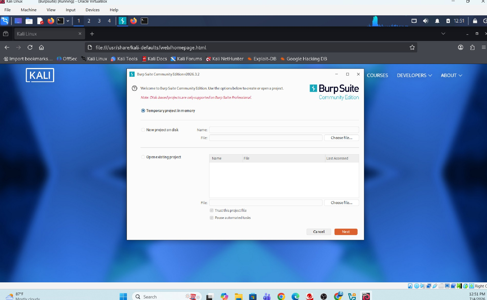

This screenshot shows Burp Suite launching in Community Edition. Starting Burp Suite initializes the proxy listener and prepares the environment for intercepting browser traffic.

---

## 2. Select Burp Suite User Defaults
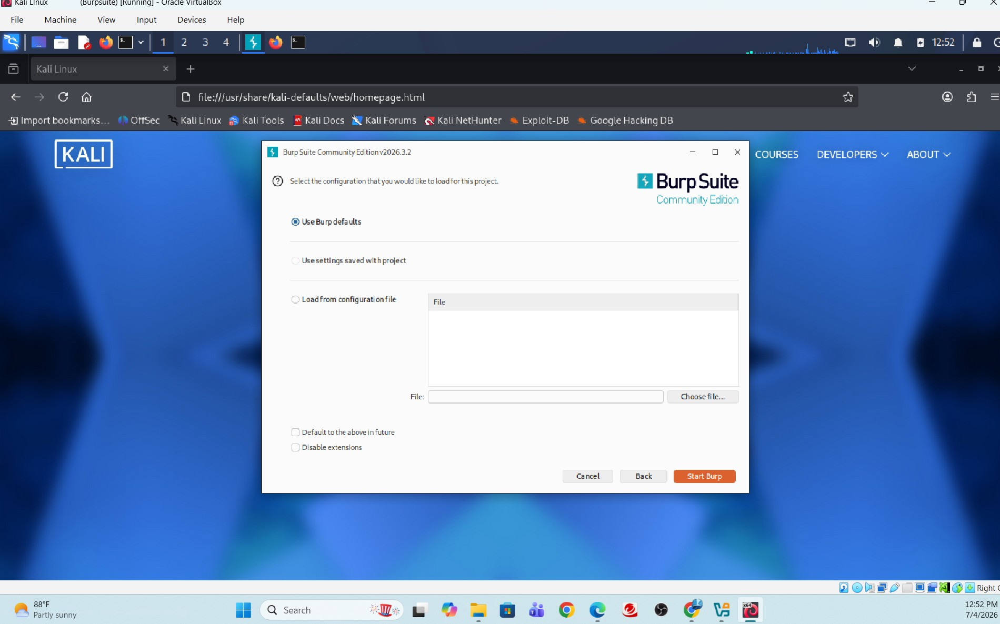

I selected the default Burp Suite configuration. This ensures consistent behavior across tools such as Proxy, Repeater, and Intruder.

---

## 3. Configure Browser Proxy
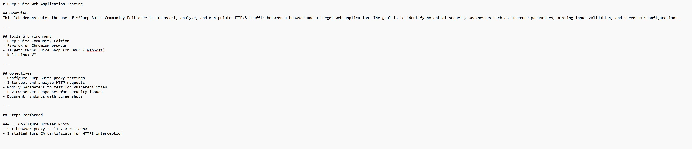

This screenshot shows the browser proxy settings being configured. Burp Suite requires the browser to send traffic through its proxy listener (usually 127.0.0.1:8080).

---

## 4. Configure Firefox Proxy and Port
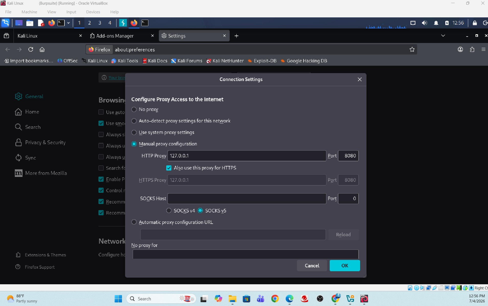

Firefox is configured to route all HTTP/S traffic through Burp Suite. This step is essential for intercepting and analyzing requests.

---

## 5. Turn Intercept On
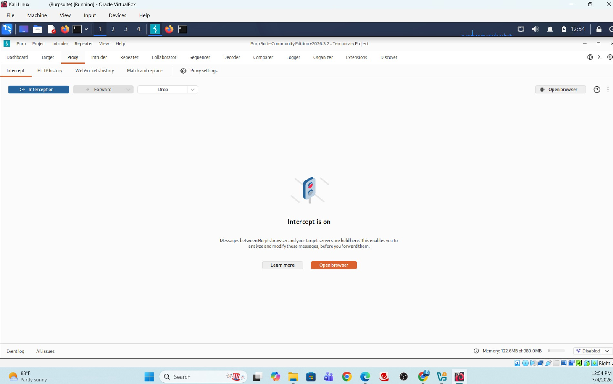

Intercept mode is enabled, allowing Burp Suite to pause and display each request before it reaches the server. This is the core of manual request manipulation.

---

## 6. Turn Intercept Off
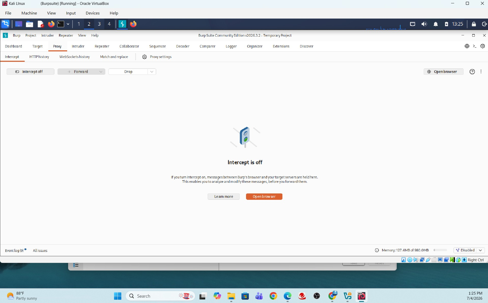

Intercept is disabled to allow traffic to flow normally. This is useful when you want to browse without interruption or after capturing the necessary requests.

---

## 7. Interpreting Requests
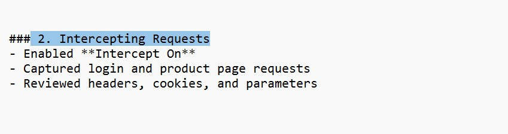

This screenshot shows how Burp Suite displays HTTP request details. Understanding request structure is essential for identifying parameters and potential vulnerabilities.

---

## 8. Manipulating Requests
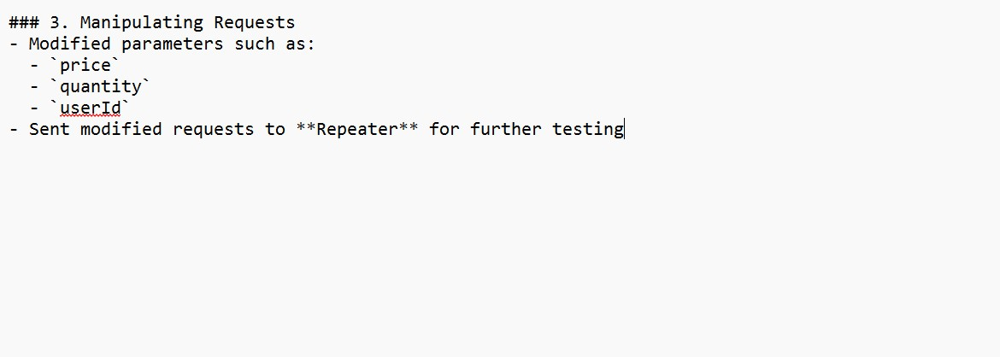

I modified a request before sending it to the server. This demonstrates how Burp Suite can be used to test input validation and exploit insecure parameters.

---

## 9. Analyzing Responses
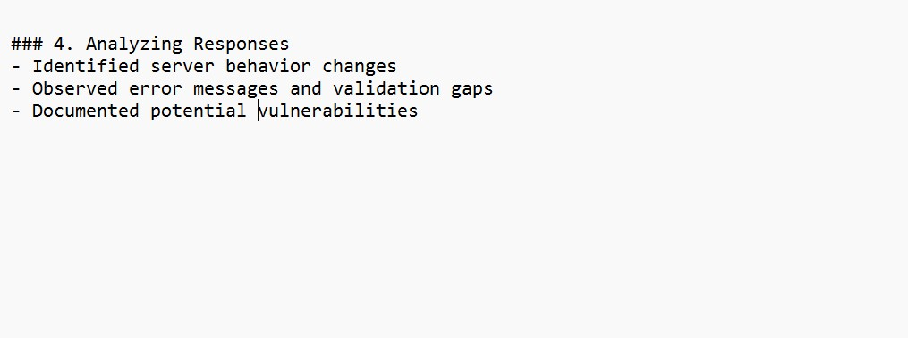

This screenshot shows the server’s response to a modified request. Analyzing responses helps identify whether the application is vulnerable to attacks such as SQL injection or XSS.

---

## 10. Burp Suite Traffic Displayed
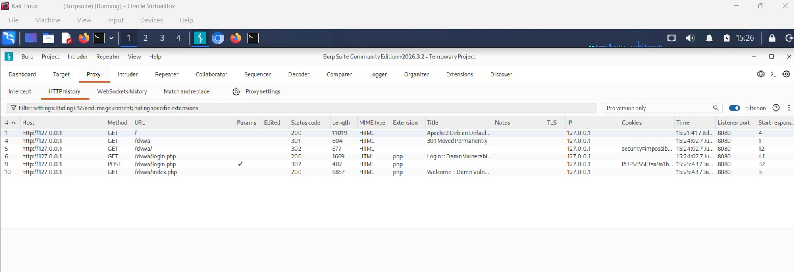

This view shows captured traffic flowing through Burp Suite. It confirms that the proxy is working and that Burp Suite is successfully intercepting browser requests.

---

## 11. Burp Suite Screen Showing Security Level and POST Request
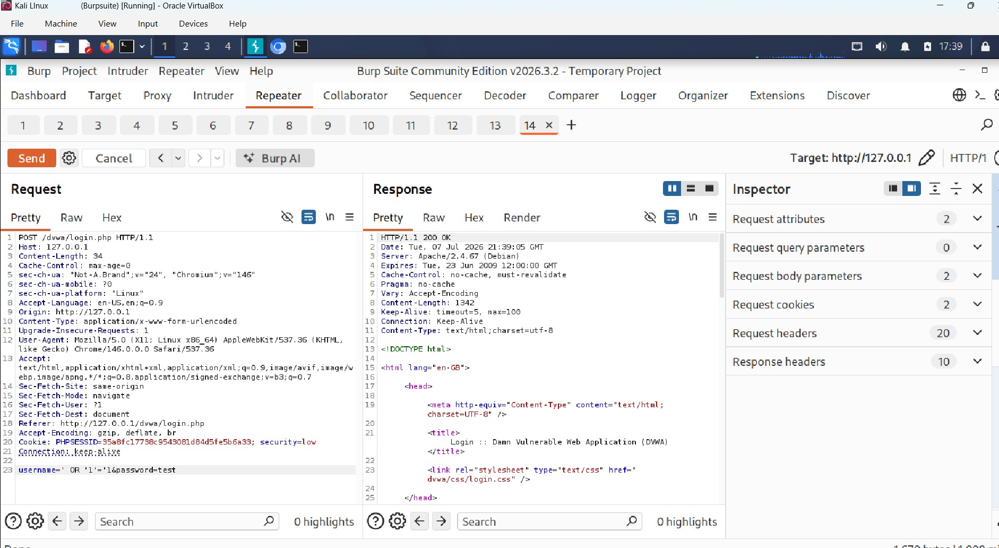

This screenshot shows a POST request captured from DVWA with the security level set to Low. This is the starting point for deeper exploitation in Lab 1.

---

## Conclusion
This workflow demonstrates the essential Burp Suite skills required for web application testing. These foundational steps prepare you for more advanced labs, including DVWA exploitation, SQL injection, and parameter manipulation.
