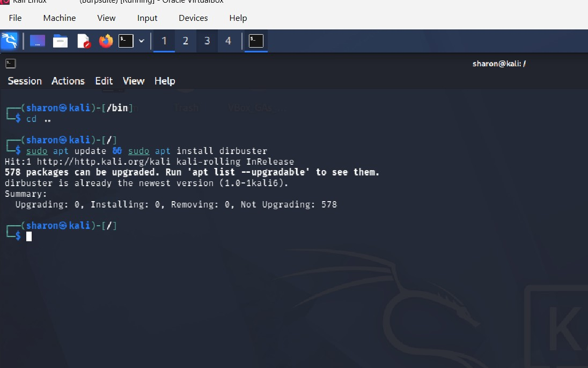
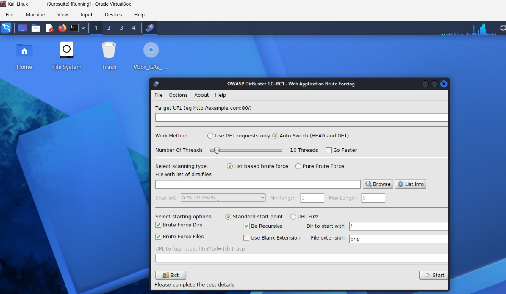
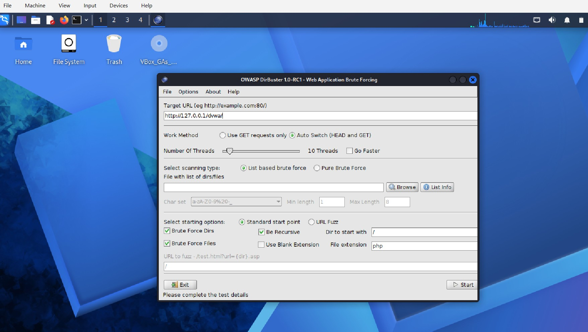
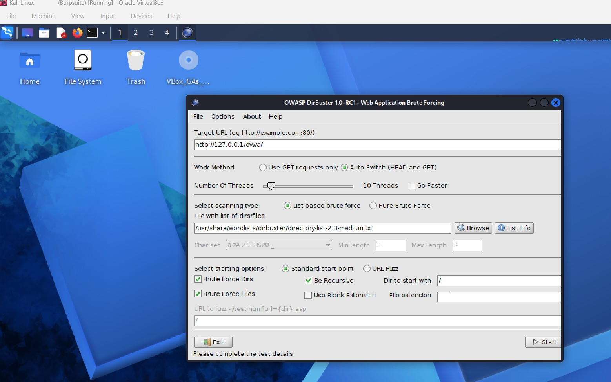
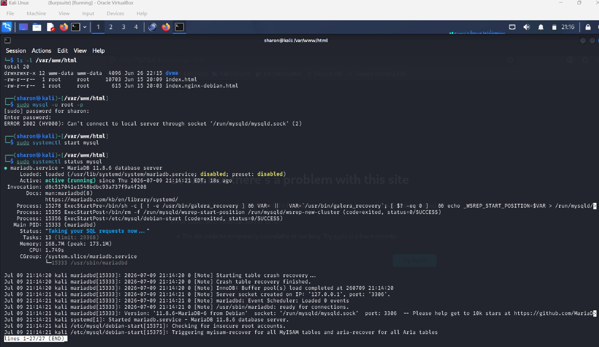
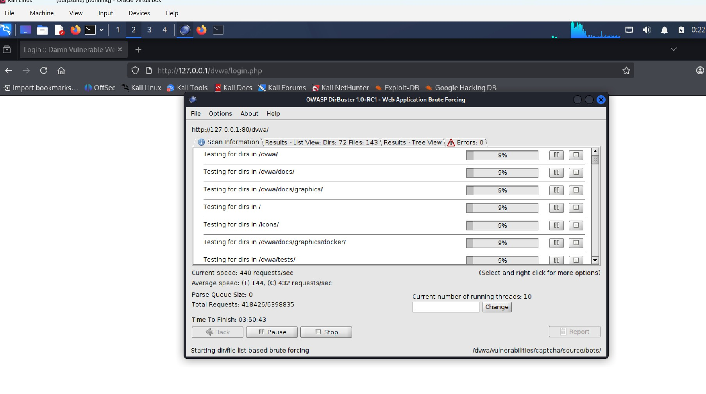
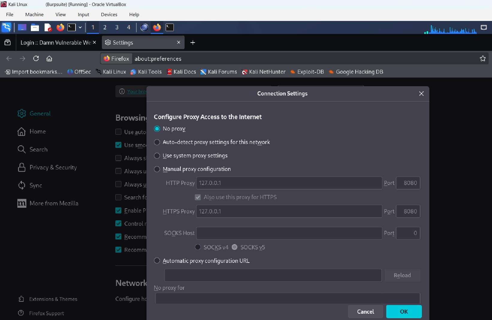

DirBuster Lab — README

Overview
This lab demonstrates directory and file enumeration against **DVWA** using **OWASP DirBuster** on Kali Linux. You configured your environment, validated backend services, executed a brute‑force scan, and documented the results.

---

Screenshots & Explanations

### 1️⃣ Update DirBuster  

**What I did:**  
Updated package lists and confirmed DirBuster was installed.

**Why:**  
Ensures the tool is current and avoids dependency issues.

**Meaning:**  
Your Kali environment is ready for directory enumeration.

---

### 2️⃣ Launch DirBuster  

**What I did:**  
Opened the DirBuster GUI.

**Why:**  
The GUI allows configuration of threads, recursion, wordlists, and scan type.

**Meaning:**  
You are entering the configuration phase of the enumeration process.

---

### 3️⃣ Enter Target URL  

**What I did:**  
Set the target to:  
`http://127.0.0.1/dvwa/`

**Why:**  
DVWA is hosted locally, making enumeration fast and reliable.

**Meaning:**  
DirBuster will enumerate directories and files inside DVWA.

---

### 4️⃣ Select Wordlists  

**What I did:**  
Selected the medium DirBuster wordlist and enabled:  
- Brute Force Dirs  
- Brute Force Files  
- Recursive scanning  
- 10 threads

**Why:**  
Medium wordlist = balanced speed + thoroughness.  
Recursion = deeper directory discovery.

**Meaning:**  
Your scan is configured for realistic penetration testing.

---

### 5️⃣ Start MariaDB  

**What I did:**  
Checked and started the MariaDB service.

**Why:**  
DVWA requires a running database backend.

**Meaning:**  
Your DVWA environment is fully operational.

---

### 6️⃣ DirBuster Results  

**What I did:**  
Monitored the live scan results showing discovered directories such as:  
- `/dvwa/docs/graphics/`  
- `/dvwa/tests/`  
- `/icons/`  
- `/dvwa/vulnerabilities/...`

**Why:**  
Verifies recursion, performance, and successful directory discovery.

**Meaning:**  
DirBuster successfully enumerated multiple hidden directories and files.

---

### 7️⃣ Configure Firefox — No Proxy  

**What I did:**  
Set Firefox to **No Proxy**.

**Why:**  
DVWA must be reachable directly on port 80.

**Meaning:**  
Disabling the proxy ensures DirBuster scans the correct target.

