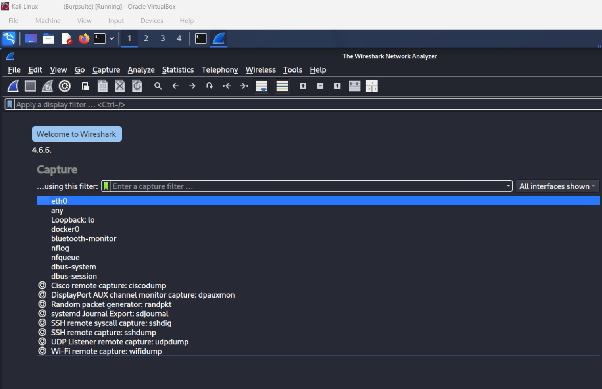
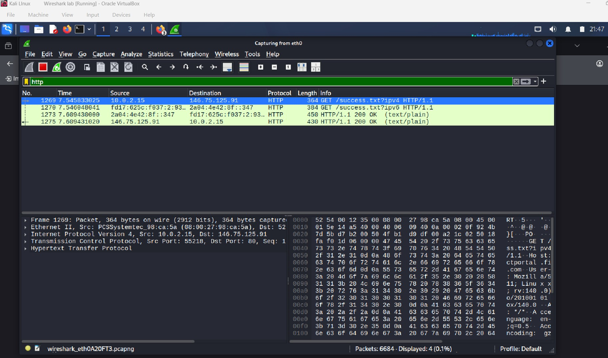
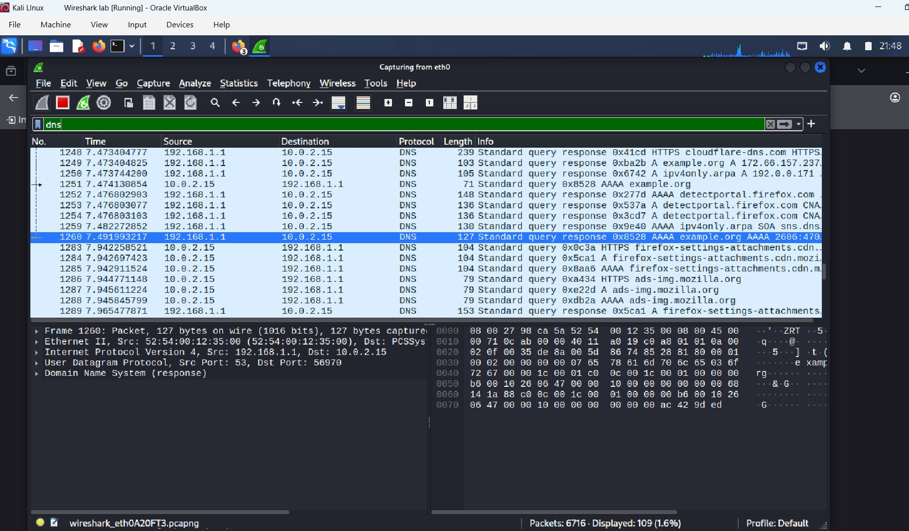
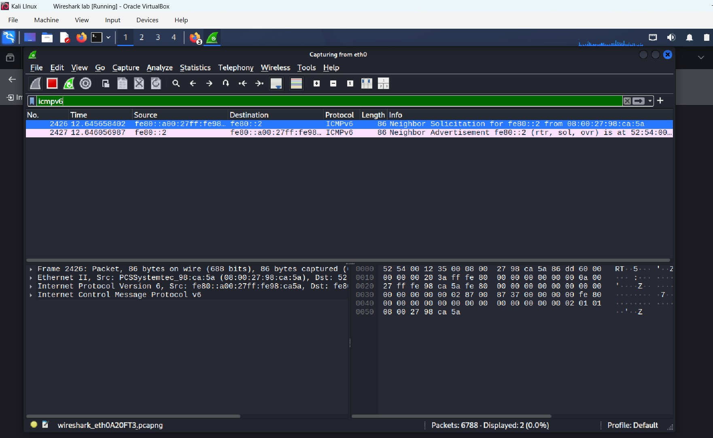

⭐ README.md — Wireshark Network Traffic Analysis Lab
📌 Overview
This lab demonstrates how I captured, filtered, and analyzed network traffic using Wireshark inside a Kali Linux virtual machine. The goal was to observe how different protocols behave on the network and interpret what the packets reveal about system communication.

The analysis focuses on three core protocols:

HTTP – web traffic

DNS – domain name resolution

ICMPv6 – IPv6 neighbor discovery

These protocols represent foundational skills for SOC analysts, penetration testers, and cybersecurity professionals.

🖥️ Environment Setup
Wireshark Startup & Interface Selection

Wireshark displays all available network interfaces on startup.
For a VirtualBox VM, eth0 is the correct interface because it handles all outbound and inbound traffic for the VM.

Selecting eth0 ensures that real network communication is captured, including:

Web browsing

DNS lookups

Background system traffic

ICMP/ICMPv6 neighbor discovery

This step demonstrates proper capture setup — a critical skill for packet analysis.

🌐 HTTP Traffic Analysis
HTTP GET Request

What I Did
I applied the display filter:

Code
http
This isolates HTTP traffic, allowing me to focus specifically on web requests and responses.

What I’m Seeing
The highlighted packet is an HTTP GET request sent from my Kali VM (10.0.2.15) to a remote server (146.75.125.91).

Key details include:

GET /success.txt?ipv4 — the resource being requested

Host header — identifies the domain

TCP layer — shows the connection details

IP layer — shows source/destination IPs

Ethernet layer — shows MAC addresses inside the VM

What It Means

HTTP GET requests reveal:

What resources a client is requesting

Which servers it communicates with

Whether traffic is encrypted (HTTP vs HTTPS)

Potential indicators of compromise (suspicious URLs, unusual user agents, etc.)

This demonstrates my ability to inspect web traffic and understand how clients interact with servers.

🔎 DNS Traffic Analysis
DNS Query & Response

What I Did

I applied the DNS filter:
Code
dns
Then narrowed it to responses only:

Code
dns.flags.response == 1
What I’m Seeing
My VM is receiving DNS responses from the DNS server (192.168.1.1).
The highlighted packet shows:

A Standard Query Response

For the domain example.org

Returning an AAAA record (IPv6 address)

What It Means

DNS is the “phonebook” of the internet — it translates domain names into IP addresses.

Key insights:

A record = IPv4

AAAA record = IPv6

DNS responses reveal which domains the system is contacting

Background traffic (Mozilla, Cloudflare, Discord) is normal for Firefox

This demonstrates my ability to interpret DNS behavior and understand how systems resolve domain names.

📡 ICMPv6 Traffic Analysis

What I Did

I applied the filter:

Code
icmpv6

What I’m Seeing

Two packets appear:

Neighbor Solicitation

My VM asks: “Who has IPv6 address fe80::2?”

Neighbor Advertisement

The other device replies: “I have that address.”

What It Means

This is part of IPv6 Neighbor Discovery Protocol, the IPv6 equivalent of ARP in IPv4.

It is used for:

Discovering other hosts on the local network

Resolving IPv6 addresses to MAC addresses

Maintaining reachability information

These packets appear even without manual pings — they are normal background IPv6 traffic.

This demonstrates my understanding of low‑level network discovery mechanisms.

🧠 Conclusion

This Wireshark lab demonstrates my ability to:

Select the correct capture interface

Apply protocol‑specific filters

Interpret HTTP, DNS, and ICMPv6 packets

Understand how clients communicate with servers

Analyze name resolution and neighbor discovery

Document findings clearly and professionally
